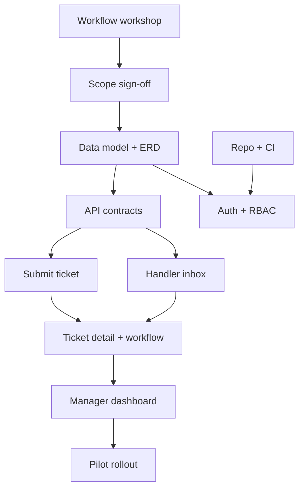

# HelpDesk Lite — Initial Execution Plan

## Delivery approach

**Staged delivery** over three phases, with a **timeboxed discovery** gate before heavy build.

| Phase | Duration (indicative) | Outcome |
|-------|----------------------|---------|
| Phase 0 — Decide | 1 week | Signed workflow + v1 scope |
| Phase 1 — Foundation | 1–2 weeks | Auth, schema, empty UI shell |
| Phase 2 — MVP ticketing | 2–3 weeks | Submit → assign → resolve path |
| Phase 3 — Pilot | 1 week | One department live on staging |

## What work comes first

1. **Workflow workshop** — Unblocks schema, UI, and Jira tickets marked Partial/Blocked.
2. **Scope one-pager sign-off** — Locks non-goals and prevents scope creep.
3. **Repo + CI + environments** — Can start in parallel with workshop prep.
4. **Wireframes** — After workshop, before API implementation.

## Dependency view

## Sprint-oriented view (first 3 sprints)

### Sprint 0 (Discovery) — do not build features yet

| Item | Owner | Done when |
|------|-------|-----------|
| Schedule workshop | PM | Date set, attendees confirmed |
| Run workshop | PM + Ops | States, roles, fields documented |
| Publish v1 scope doc | PM | Stakeholder email approval |
| Approve wireframes | Design + PM | Click-through agreed |

**Exit criteria:** No open P0 questions on workflow or v1 scope.

### Sprint 1 — Foundation (executable after Sprint 0)

| Item | Notes |
|------|-------|
| Initialize repository | Lint, test, README |
| Dev/staging environments | Deploy pipeline |
| Auth + 3 roles | Requester, Handler, Manager |
| Ticket schema + migrations | Matches workshop output |
| CI green on main | Required for merge |

**Do not start yet:** Submit UI, dashboard, assignment automation, KB.

### Sprint 2 — Core path

| Item | Notes |
|------|-------|
| Submit ticket (UI + API) | Required fields only |
| My tickets (requester) | List + detail read-only |
| Handler inbox | Filter open / assigned to me |
| Ticket detail | Comments, assign, status transitions |
| Workflow enforcement | Server-side transition rules |

### Sprint 3 — Visibility + pilot prep

| Item | Notes |
|------|-------|
| Manager dashboard | Counts by status + assignee |
| Simple overdue flag | Configurable threshold |
| Staging pilot playbook | Training doc + feedback form |
| Bug buffer | 20% capacity |

## Kanban-style “do not start yet”

| Work | Reason |
|------|--------|
| Knowledge base | Out of v1 scope |
| Email ingestion | Channel strategy not decided |
| Auto-assignment rules | Needs volume data from pilot |
| Custom reporting | Manager dashboard sufficient for v1 |
| Mobile app | Desktop-first internal tool |

## Moving from requirement to active delivery

1. **Freeze** v1 scope and workflow doc (Phase 0 exit).
2. **Create** Jira epics/stories from breakdown (Day 2).
3. **Filter** backlog: only Ready → Sprint 1; Partial/Blocked stay visible with reasons.
4. **Build** foundation → core path → dashboard (Sprints 1–3).
5. **Pilot** one team; collect metrics: time-to-assign, open ticket age, adoption.
6. **Prioritize v2** from pilot data (notifications, KB, routing).

## Success metrics for v1 pilot

- ≥ 80% of pilot dept. requests created in HelpDesk Lite (not email)
- Median time to first assignment &lt; 1 business day
- Managers can answer “how many open?” without a manual spreadsheet
- Handler NPS or qualitative “easier than before” from 5+ interviews
